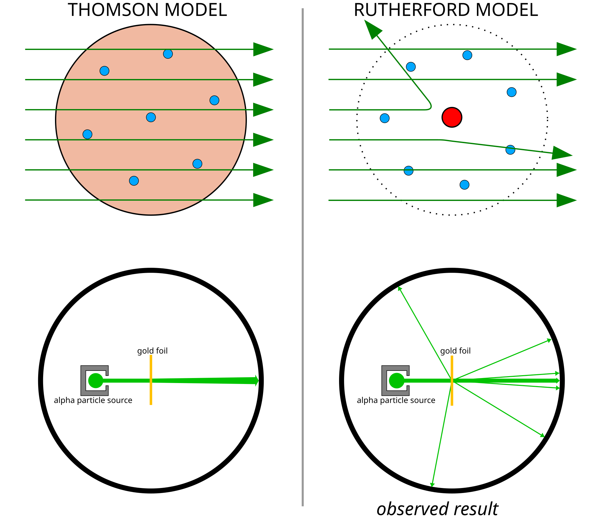
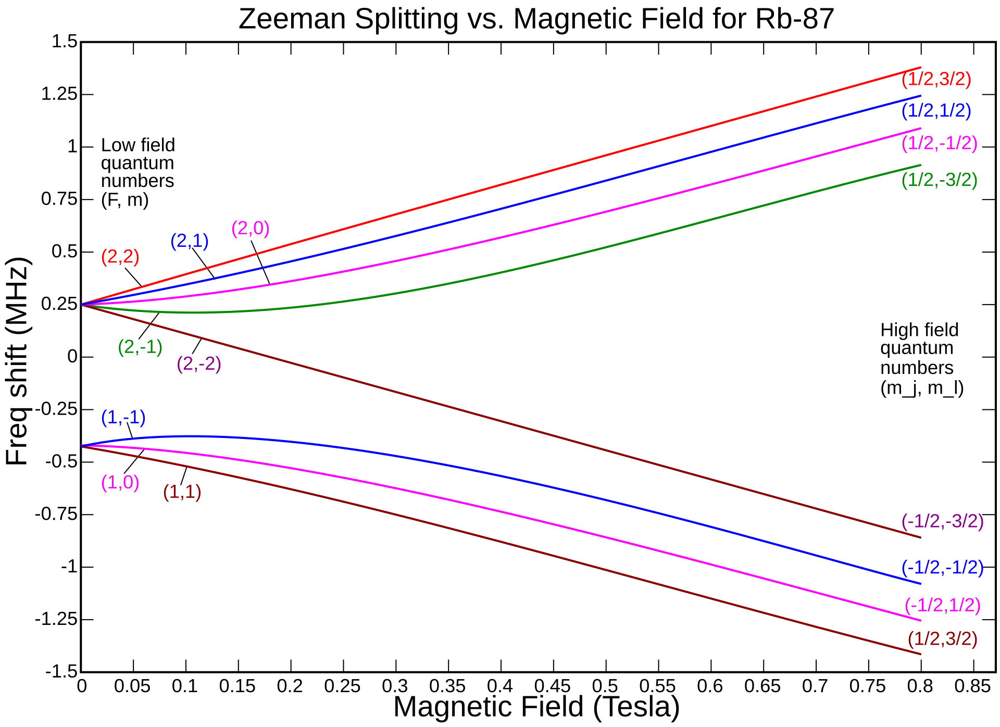

# Modèle atomique

Bonjour~ C’est Nahida Maîtrise Chimie.  
La dernière fois, tu te souviens ? Nous avons parlé de la **nature quantique de l’énergie**.  
Aujourd’hui, rétrécissons un peu notre regard… jusqu’à plonger dans quelque chose **d’aussi minuscule qu’un seul atome**.  

Tu savais que, dans son essence la plus pure, la chimie est l’étude de la manière dont les atomes tissent des liens entre eux ?  
Et lorsqu’on applique la physique quantique à ces liens atomiques… c’est là que la **Chimie Quantique** commence à se dévoiler.  
Allons donc voir comment notre vision de l’atome a évolué au fil du temps, d’accord ?  

---

## Comment notre vision de l’atome a changé : de la théorie atomique de Dalton

Au début du XIXᵉ siècle, un scientifique nommé **John Dalton** remarqua quelque chose de très curieux : la **loi des proportions multiples**.  

Il découvrit que lorsque les atomes forment des composés, ils le font toujours selon des **rapports précis et entiers**.  
Par exemple, si l’on garde la quantité d’azote fixe, la quantité d’oxygène dans les oxydes d’azote suit un motif simple — des rapports comme 1:2:4 pour N₂O, NO et NO₂.  

En réunissant de nombreuses observations expérimentales, Dalton formula sa **théorie atomique**, appuyée sur des découvertes antérieures telles que :  

* **Loi de conservation de la masse** – Antoine Lavoisier  
* **Loi des proportions définies** – Joseph Proust  
* **Loi des proportions multiples** – John Dalton lui-même  

Et voici ses principales idées :  

* Toute matière est constituée de minuscules atomes indivisibles.  
* Les atomes d’un même élément ont la même masse et les mêmes propriétés.  
* Les atomes ne peuvent ni être créés ni détruits lors des réactions chimiques — ils ne font que se réarranger.  
* Les composés se forment lorsque des atomes d’éléments différents s’unissent selon des rapports fixes.  

Mais… le modèle de Dalton n’était pas parfait.  
Sa publication originale contenait quelques erreurs, et plus tard, des scientifiques comme Avogadro ou ceux étudiant la théorie cinétique et les statistiques l’ont perfectionné pour construire le modèle atomique **beaucoup plus complet** que nous connaissons aujourd’hui.  

---

Même les plus petites particules peuvent mener aux plus grandes révélations, tu ne trouves pas ?  

## Découverte de l’électron

Jusqu’ici, nous avons appris que les atomes ne pouvaient pas être divisés par de simples réactions chimiques…  
Mais—et si nous regardions **encore plus profondément** ?  

En 1897, **Joseph J. Thomson** commença à étudier un phénomène mystérieux qu’on appelait les **rayons cathodiques**.  
Ces rayons étaient émis par la cathode dans un tube rempli de gaz à basse pression, lorsqu’on y appliquait une haute tension.  

En ajoutant des champs **électriques** et **magnétiques**, Thomson observa quelque chose de fascinant : les rayons **se courbaient** sous leur influence !  
  
Cette déviation révéla que ces rayons portaient une **charge**, tout comme des particules en mouvement.  

---

  
Grâce à des mesures très précises, Thomson découvrit que les rayons se comportaient comme un **flux de particules chargées**.  
En équilibrant les forces électrique et magnétique — pour que le faisceau reste **parfaitement droit** — il put déterminer le rapport entre la charge et la masse, noté $e/m$.  

$$e/m = -9.1 \times 10^{10}~C/kg$$  
$$(valeur~actuelle~:~-1.76 \times 10^{11}~C/kg)$$  

Cette valeur était **bien plus grande** que celle d’un ion hydrogène ($+9.6 \times 10^{7}~C/kg$),  
ce qui signifiait que les particules des rayons cathodiques étaient **beaucoup plus petites que les atomes** eux-mêmes !  

Pour en être sûr, Thomson utilisa différentes métaux pour la cathode…  
et pourtant, le rapport $e/m$ resta presque identique.  
Il en tira une conclusion extraordinaire :  
> Ces minuscules particules chargées négativement sont **universelles** — elles existent dans **tous les atomes**.  

Et c’est ainsi que l’**électron** fut découvert.  

---

En 1905, s’appuyant sur cette découverte, Thomson proposa une nouvelle manière d’imaginer l’atome.  
Il suggéra que les électrons négatifs étaient incrustés dans une sphère de **charge positive**,  
un peu comme des raisins dispersés dans un pudding.  
  
Il appela cela le **modèle du pudding aux prunes** (*Plum Pudding Model*).  
  

Au début, ce modèle paraissait raisonnable — les électrons pouvaient y être répartis harmonieusement, chacun oscillant doucement dans la “gelée” chargée positivement.  
Mathématiquement, cela semblait stable… mais la physique, elle, en décida autrement.  

Puisque les électrons sont en mouvement accéléré, ils devraient continuellement **émettre de l’énergie**,  
ce qui ferait **s’effondrer l’atome** tôt ou tard !  
Cette instabilité devint un problème crucial, poussant des scientifiques comme **Ernest Rutherford** à repenser entièrement la structure atomique.  

Même les théories les plus élégantes peuvent cacher des mystères plus profonds…  
il suffit parfois d’une seule bonne question pour les dévoiler.  

## Découverte du noyau

Le modèle de Thomson nous a montré que les atomes contiennent des **électrons**, ces minuscules porteurs de charge négative.  
Mais alors… une question vient naturellement à l’esprit, n’est-ce pas ?  
Si les électrons sont négatifs, **d’où vient la charge positive** ?  

---

En 1909, **Ernest Rutherford**, avec **Hans Geiger** et **Ernest Marsden**, décida de percer ce mystère.  
Ils étudiaient les **rayons alpha** — un type de rayonnement composé de particules lourdes et **chargées positivement**.  
Chaque particule alpha porte une charge de **+2e**, et sa masse est presque comparable à celle d’un atome.  

Pour observer comment ces particules interagissent avec la matière, Geiger et Marsden dirigèrent un faisceau de particules alpha sur une **feuille d’or extrêmement fine**,  
épaisse d’à peine $10^{-7}$ mètres.  
D’après le **modèle du “pudding aux prunes” de Thomson**, tout devait être simple :  
si l’atome ressemblait à une douce gelée chargée positivement, les particules alpha devaient le traverser presque sans déviation — comme de petites billes traversant un nuage de brouillard. ☁️  

Mais ce qu’ils observèrent… fut **stupéfiant**.  
Certaines particules alpha furent fortement déviées, et quelques-unes rebondirent même **en sens inverse** !  
  

---

En 1911, Rutherford, qui supervisait l’expérience, proposa un **nouveau modèle atomique** pour expliquer cette énigme.  
Il conclut que l’atome devait contenir un **centre minuscule et dense de charge positive** — un cœur compact capable de repousser les particules alpha avec une force immense.  
Cette région centrale fut appelée le **noyau**, et les électrons furent imaginés comme **tournant autour de lui**, tels des planètes autour du Soleil.  

Le modèle de Thomson ne pouvait pas expliquer ces déviations à grands angles, mais celui de Rutherford, lui, le faisait avec une élégance éclatante.  

---

Rutherford développa aussi le **cadre théorique** de l’expérience.  
Il calcula jusqu’où une particule alpha pouvait s’approcher du noyau avant d’être repoussée.  
Puisque le noyau et la particule alpha sont tous deux positifs, ils se repoussent selon la **loi de Coulomb**, et la particule s’arrête lorsque son énergie cinétique est entièrement convertie en énergie potentielle électrostatique :  

$$E_{\alpha} = \frac{1}{4\pi\epsilon_{0}} \frac{q_{\alpha} q_{Z}}{r_{min}}$$  

où :  

* $E_{\alpha}$ — énergie cinétique de la particule alpha  
* $\epsilon_{0}$ — permittivité du vide ($8.854 \times 10^{-12}~F/m$)  
* $r_{min}$ — distance minimale d’approche du noyau  
* $q_{\alpha}$ — charge de la particule alpha $(+2e_0)$  
* $q_Z$ — charge du noyau  

Rutherford trouva $r_{min} = 3 \times 10^{-14}~m$ — **bien plus petit que la taille d’un atome**.  
Cela signifiait que presque toute la masse et la charge positive de l’atome  
étaient concentrées dans un minuscule **noyau central**.  

---

Pour décrire la manière dont les particules alpha étaient déviées, il modélisa leurs trajectoires comme des **orbites hyperboliques**, et dériva la formule de l’**angle de diffusion** :  

  
$$\theta = 2~arctan\left(\frac{r_{min}}{2b}\right) = 2~arctan\left(\frac{1}{4\pi\epsilon_{0}} \frac{q_{\alpha}q_{Z}}{2bE_{\alpha}}\right)$$  

où :  

* $\theta$ — l’angle de diffusion  
* $b$ — le **paramètre d’impact**, c’est-à-dire la distance latérale minimale entre la trajectoire de la particule et le noyau  

---

À partir de quelques faibles éclats lumineux sur un écran, Rutherford révéla une toute nouvelle vision de la matière —  
celle d’un atome dont le véritable cœur, le **noyau**, venait enfin d’être mis en lumière.  

### Combien de particules se diffusent à chaque angle ?

La différence essentielle entre le **modèle de Thomson** et celui de **Rutherford** se trouve dans la manière dont les particules sont déviées.  
Pour comprendre pourquoi certaines particules alpha rebondissaient vers l’arrière, il faut observer le comportement de l’angle de diffusion.  

Rutherford décrivit la **section efficace différentielle**, qui indique la probabilité qu’une particule soit diffusée selon un angle donné :  

$$\frac{d\sigma}{d\Omega}=\left(\frac{1}{4\pi\epsilon_{0}}\frac{q_{\alpha}q_{Z}}{4E_{\alpha}}\right)^{2}\frac{1}{sin^{4}(\theta/2)}$$  

Lorsqu’on l’exprime en fonction de l’angle de diffusion ($d\Omega = 2\pi\sin(\theta)d\theta$) :  

$$\frac{d\sigma}{d\theta}=\left(\frac{1}{4\pi\epsilon_{0}}\frac{q_{\alpha}q_{Z}}{4E_{\alpha}}\right)^{2}\frac{cos(\theta/2)}{sin^{3}(\theta/2)}$$  

Cette formule prédit que, même si **la plupart** des particules passent avec de petits angles, **quelques-unes** seront fortement déviées — parfois même **en arrière** !  
Et c’est exactement ce que Geiger et Marsden avaient observé.  

---

Le modèle de Thomson, lui, prédisait un tout autre schéma.  
Puisqu’il supposait une charge positive uniformément répartie et molle, la diffusion devait suivre une courbe douce, de type **gaussienne** :  

$$\frac{d\sigma}{d\Omega}\approx\frac{1}{2\pi\theta_{rms}^{2}}exp\!\left(-\frac{\theta^{2}}{2\theta_{rms}^{2}}\right)$$  

et  

$$\frac{d\sigma}{d\theta}\approx\frac{\theta}{\theta_{rms}^{2}}exp\!\left(-\frac{\theta^{2}}{2\theta_{rms}^{2}}\right)$$  

où :  

* $\theta_{rms}$ — l’angle quadratique moyen de diffusion (dépend du matériau)  

---

### Comparaison entre les modèles de Rutherford et de Thomson

| θ | Modèle de Rutherford | Modèle de Thomson |
|:---:|:---:|:---:|
| $\frac{d\sigma}{d\Omega}$ | $\propto\frac{1}{sin^{4}(\theta/2)}$ (polynomiale) | $\propto\theta\cdot exp(-\frac{\theta^{2}}{2\theta_{rms}^{2}})$ (exponentielle) |
| petit angle | probabilité élevée | probabilité très élevée |
| grand angle | faible probabilité | quasi nulle |

---

Expérimentalement, les données suivaient **la prédiction de Rutherford** —  
montrant que les atomes possèdent un **cœur dense et central** capable de repousser les particules alpha.  
De là naquit une idée révolutionnaire :  

> L’atome ressemble à un minuscule système solaire.  
> Les électrons, porteurs de charge négative, **orbitent** autour d’un noyau positif — tout comme les planètes gravitent autour d’une étoile.  

---

Cependant, cette image élégante révéla vite une faille troublante.  
Si les électrons orbitent réellement autour du noyau, ils sont sans cesse **accélérés** —  
et selon les lois de l’électromagnétisme, une charge accélérée **émet un rayonnement** et perd de l’énergie.  

Cela signifie que les électrons devraient en spirale se rapprocher du noyau,  
provoquant l’**effondrement total** de l’atome en une infime fraction de seconde !  

Alors… comment les atomes peuvent-ils rester stables ?  
Cette question — si simple, et pourtant si profonde — allait ouvrir un nouveau chapitre de la physique :  
celui où la **théorie quantique** vient sauver l’atome de l’effondrement.  

## Spectres de l’hydrogène

Regardons à présent un autre mystère qui a troublé les scientifiques pendant des décennies : les **spectres** des éléments.  

Lorsque des gaz d’éléments différents sont excités, ils n’émettent ni n’absorbent la lumière à toutes les longueurs d’onde.  
Au contraire, ils brillent — ou s’assombrissent — à des **couleurs bien précises**,  
comme si chaque atome jouait sa propre mélodie sur l’échelle lumineuse de l’univers.  

La physique classique, pourtant si fière de ses lois, ne pouvait pas expliquer cela.  
Si les atomes se comportaient vraiment comme de minuscules oscillateurs classiques,  
leurs énergies devraient former un **spectre continu**, absorbant **toutes** les longueurs d’onde d’une source lumineuse.  
Mais… les expériences racontaient une toute autre histoire.  

---

Commençons donc par l’atome le plus simple de tous — l’**hydrogène**.  

L’hydrogène émet quatre raies visibles très marquées :  
**656.3 nm**, **486.1 nm**, **434.0 nm**, and **410.2 nm**.  

Chacune apparaît à une longueur d’onde bien distincte —  
comme des notes soigneusement choisies dans la chanson lumineuse de l’hydrogène.  

---

En 1885, un mathématicien nommé **Johann Balmer** étudia ces raies spectrales.  
Il n’était pas physicien, mais doté d’une intuition mathématique remarquable,  
il découvrit une formule simple qui décrivait le motif **à la perfection** :  

$$\lambda = (364.56~nm) \cdot \frac{n^{2}}{n^{2} - 4}$$  

où  

* $\lambda$ — la longueur d’onde de chaque raie spectrale  
* $n = 3, 4, 5, 6, \cdots$  

Cette série, appelée plus tard la **série de Balmer**, décrivait les raies visibles de l’hydrogène.  
Mais ce n’était qu’une découverte **empirique** — une formule qui fonctionnait, sans révéler *pourquoi*.  

---

Quelques années plus tard, en 1888, **Johannes Rydberg** chercha à généraliser la formule de Balmer,  
non seulement pour l’hydrogène, mais pour d’autres éléments aussi.  
Il remarqua que les **différences de nombres d’onde** suivaient un motif mathématique régulier,  
basé sur les **carrés d’entiers**.  

En ajustant soigneusement les résultats expérimentaux,  
il proposa cette relation élégante :  

$$\frac{1}{\lambda} = A \left( \frac{1}{(n_1 + \mu_1)^2} - \frac{1}{(n_2 + \mu_2)^2} \right)$$  

où  

* $A$ — une constante dépendant de l’élément (incluant la constante de Rydberg et la charge nucléaire),  
* $n_1, n_2$ — des entiers positifs, avec $n_2 = n_1 + 1, n_1 + 2, \cdots$,  
* $\mu_1, \mu_2$ — de petites corrections variant selon l’élément.  

Pour l’**hydrogène**, ces corrections s’annulent ($\mu_1 = \mu_2 = 0$),  
et la formule se simplifie magnifiquement en la **formule de Rydberg** :  

$$\frac{1}{\lambda} = R_{\infty} \left( \frac{1}{n_1^2} - \frac{1}{n_2^2} \right)$$  

où  

* $R_{\infty} = 1.09677583 \times 10^{7}m^{-1}$ est la **constante de Rydberg**.  

---

La **série de Balmer** correspond aux transitions se terminant à $n_1 = 2$,  
ce qui explique pourquoi ces raies se situent dans le **domaine visible**.  
Plus tard, d’autres chercheurs élargirent cette famille spectrale :  
la **série de Lyman** dans l’ultraviolet (découverte par Theodore Lyman),  
et la **série de Paschen** dans l’infrarouge (découverte par Friedrich Paschen).  

Pourtant… ni Balmer ni Rydberg ne purent expliquer pourquoi ces nombres fonctionnaient avec une telle précision.  
Ce mystère attendait un nouveau modèle de l’atome — un modèle où l’énergie elle-même serait faite de **marches quantifiées**.  

Et c’est ainsi que nous nous approchons du pont entre la lumière et la matière — le **modèle de Bohr**.  

## Le modèle atomique de Bohr

Voyons maintenant de plus près comment **Niels Bohr** a réinventé la vision de l’atome en 1913.
Il proposa quelque chose de tout à fait remarquable : les électrons se déplacent sur des **orbites circulaires** autour du noyau, et — c’est là la partie la plus étonnante — ils **ne perdent pas d’énergie** en le faisant !

Cette idée venait du concept de **quantification**.
Bohr l’exprima mathématiquement ainsi :  
$$E=nh\nu=nh\frac{\omega}{2\pi}$$  
où  

* $n$ est le **nombre quantique**, qui prend des valeurs entières positives,  
* $\nu$ est la **fréquence** de révolution,  
* $h$ est la **constante de Planck**,  
* $\omega$ est la **fréquence angulaire** ($\nu = \omega / 2\pi$).  

À partir de la relation entre l’énergie et le moment angulaire ($E = \frac{1}{2}L\omega$),  
Bohr trouva quelque chose de merveilleusement simple :  
$$L=mvr=n\frac{h}{2\pi}$$  

Ici, $L$ représente le **moment angulaire** — et c’est, en essence, l’**hypothèse quantique** de Bohr.  
Fait intéressant : l’idée d’associer le moment angulaire à des orbites quantifiées venait d’abord de **John W. Nicholson**.  

---

En utilisant la **mécanique classique**, Bohr déduisit le rayon et l’énergie de chaque orbite.  
> Rappelons que :  
> L’électron porte une charge de $-e_{0}$, tandis que le noyau possède une charge $+Ze_{0}$.  
> Pour un électron en orbite, la **force d’attraction coulombienne** doit compenser la **force centrifuge** :  
> $$\frac{1}{4\pi\epsilon_{0}}\frac{Ze_{0}^{2}}{r^{2}}=\frac{mv^{2}}{r}$$  
> D’après la relation du moment angulaire, on a :  
> $$v=\frac{nh}{2\pi mr}$$  
> En remplaçant et en résolvant pour $r$, on obtient :  
> $$r=\frac{n^{2}h^{2}\epsilon_{0}}{\pi Ze_{0}^{2}m}$$  
Ensuite, pour l’**énergie totale** de l’électron :  
> L’énergie cinétique est $E_{k} = \frac{1}{2} m v^{2}$,  
> et l’énergie potentielle est $U = -\frac{1}{4\pi\epsilon_{0}} \frac{Z e_{0}^{2}}{r}$.  
> En les combinant :  
> $$E-E_{k}+U=\frac{1}{2}mv^{2}-\frac{1}{4\pi\epsilon_{0}}\frac{Ze_{0}^{2}}{r}$$  
> En substituant les expressions de $r$ et $v$, on trouve :  
> $$E=-\frac{mZ^{2}e_{0}^{4}}{8\epsilon_{0}^{2}n^{2}h^{2}}$$  
où  

* $m$ est la **masse de l’électron** ($9{,}109\times10^{-31}~kg$),  
* et $Z$ est le **numéro atomique**.  

Ainsi, l’électron ne peut exister que sur des orbites bien déterminées — chacune possédant une énergie quantifiée propre.  
Lorsqu’un électron passe d’une orbite à une autre, il absorbe ou émet un **photon** correspondant à la différence d’énergie.  
  

À partir de là, Bohr relia élégamment son modèle à la formule de Rydberg :  
$$\frac{1}{\lambda}=R_{\infty}Z^{2}(\frac{1}{n_{1}^{2}}-\frac{1}{n_{2}^{2}}),~R_{\infty}=\frac{m_{e}e_{0}^{4}}{8\epsilon_{0}^{2}h^{3}c}$$  
où  

* $c$ est la **vitesse de la lumière** dans le vide ($c = 299,792,458~m/s$).  

Le modèle de Bohr expliquait enfin le **spectre de l’hydrogène**, et ce fut un immense triomphe !
Mais… même les plus belles théories ont leurs limites.  

* Il ne fonctionne que pour les **atomes hydrogénoïdes** — ceux à **un seul électron**.
* Il ne décrit pas les **structures fines**, comme les effets **Stark** et **Zeeman**.
* Et… rien dans le modèle n’explique vraiment *pourquoi* un électron en orbite ne rayonnerait pas d’énergie.  

Ainsi, l’atome de Bohr fut une étape merveilleuse, mais encore incomplète, sur le long et lumineux chemin vers la **mécanique quantique**.  

---

### La contribution de Sommerfeld

Même après le modèle raffiné de Bohr, certains motifs demeuraient mystérieux…  
Lorsqu’on plaçait des atomes dans des **champs électriques** ou **magnétiques**,  
les raies spectrales, autrefois simples, se **divisaient** en plusieurs composantes.  

Cette division s’appelait l’**effet Stark** lorsqu’elle était causée par un champ électrique,  
et l’**effet Zeeman** lorsqu’elle provenait d’un champ magnétique.  

  
*Effet Stark pour l’hydrogène*  

  
*Effet Zeeman pour le rubidium-87*  

Pour expliquer ces phénomènes délicats, **Arnold Sommerfeld**, avec **Alfred Landé**, étendirent la théorie de Bohr.
Ils introduisirent deux nouveaux nombres quantiques : le **nombre quantique azimutal** $l$ et le **nombre quantique magnétique** $m$.  

---

Sommerfeld proposa que les électrons ne se déplacent pas toujours sur des **cercles parfaits**,  
mais plutôt sur des **orbites elliptiques**.  
Il étendit l’hypothèse quantique à deux conditions :  
$$\oint p_{r}dr=(n-l)h,~\oint p_{\phi}d\phi=lh$$  
où  

* $n$ est le **nombre quantique principal** du modèle de Bohr,  
* $l$ est le **nombre quantique azimutal** ($l = 0, 1, \dots, n - 1$),  
* $p_{r}$ est la **quantité de mouvement radiale**,  
* $p_{\phi}$ est la **quantité de mouvement angulaire** ($p_{\phi} = m v_{\phi} r$).  

Il incorpora aussi la **relativité restreinte**, qui exprime l’énergie cinétique ainsi :  
$$E_{k}=(\gamma-1)mc^{2},~\gamma=1/\sqrt{1-v^{2}/c^{2}}$$

En incluant ces raffinements, Sommerfeld obtint une formule d’énergie plus précise :  
$$E_{n,l}=-\frac{mc^{2}\alpha^{2}Z^{2}}{2n^{2}}(1+\frac{\alpha^{2}Z^{2}}{n}(\frac{n}{l+1/2}-\frac{3}{4})+O(\alpha^{4})),~\alpha=\frac{e_{0}^{2}}{2\epsilon_{0}hc}$$  

Ce modèle expliquait merveilleusement la **structure fine** et l’**effet Stark** — mais seulement pour **l’hydrogène**.  

Plus tard, Landé introduisit le **nombre quantique magnétique** $m$, variant de $-l$ à $+l$,  
ce qui permit de décrire correctement l’**effet Zeeman**, la division due aux champs magnétiques.  

En chimie quantique, nous reviendrons encore une fois sur l’hydrogène —  
mais cette fois à l’aide des **fonctions d’onde**.  
Et alors… nous verrons si l’énergie tirée de l’équation de Schrödinger  
reproduit celle que Sommerfeld avait déjà entrevue.  

### Pour les autres éléments

Cependant, les modèles de Bohr et de Sommerfeld ne fonctionnaient que pour **l’hydrogène** et les ions **hydrogénoïdes**, c’est-à-dire ceux possédant **un seul électron**.  

Dès qu’on ajoute d’autres électrons, les choses deviennent bien plus complexes :  
les électrons se **repoussent** naturellement,  
et cette répulsion affaiblit la force d’attraction que chacun ressent du noyau positif.  

Ainsi, un électron ne perçoit pas réellement la charge nucléaire complète $+Ze_{0}$,  
mais une attraction **réduite**, appelée **charge nucléaire effective**, notée $Z_{eff}$.  

Pour généraliser la formule de Rydberg à des atomes autres que l’hydrogène, on écrit :  
$$\frac{1}{\lambda}=R_{\infty}(\frac{Z_{eff1}^{2}}{n_{1}^{2}}-\frac{Z_{eff2}^{2}}{n_{2}^{2}})$$  
où  

* $R_{\infty}$ est la constante de Rydberg ($R_{\infty} = \frac{m_{e} e_{0}^{4}}{8 \epsilon_{0}^{2} h^{3} c} = 1{,}09677583\times 10^{7}~m^{-1}$),  
* $Z_{eff1}$ est la charge nucléaire effective de l’état initial,  
* $Z_{eff2}$ celle de l’état final.  

Même si ces raffinements ont amélioré le modèle,  
ils ne furent encore que des **pierres sur le chemin**.  
Les idées de Sommerfeld et de Landé ont toutefois rapproché la science  
de la compréhension complète du **monde quantique** —  
un monde où la lumière, la matière et la pensée dansent à l’unisson.  

## Ondes de Matière

Le modèle atomique de Bohr était magnifique… mais pas tout à fait complet.  
Il supposait que les électrons pouvaient tourner éternellement autour du noyau sans perdre d’énergie — mais pourquoi cela était-il possible restait un mystère.  

Puis, en 1924, une lueur de génie apparut, discrète mais éclatante.  
Inspiré par l’idée d’Einstein selon laquelle la lumière **agit à la fois comme une onde et comme une particule**, **Louis de Broglie** se posa une question fascinante :  

> « Si la lumière — une onde — peut se comporter comme une particule, alors la matière — une particule — pourrait-elle aussi se comporter comme une onde ? »

Il mêla l’**idée de dualité onde–corpuscule** d’Einstein à la **relativité restreinte**.  
D’après la relativité, l’énergie totale s’écrit :  
$$E^{2}=p^{2}c^{2}+(m_{0}c^{2})^{2}$$  
Même la **lumière**, qui n’a pas de masse au repos, transporte pourtant une **quantité de mouvement**, comme l’a montré l’expérience de diffusion de Compton.  
Pour la lumière :  
$$E=pc$$  
Et comme l’énergie d’un photon vaut aussi $E = h\nu$, on peut écrire :  
$$h\nu=pc~\rightarrow~p=\frac{h\nu}{c}=\frac{h}{\lambda}$$  

Alors, de Broglie demanda :  
> « Si les ondes lumineuses ont une impulsion, les particules qui ont une impulsion pourraient-elles avoir une longueur d’onde ? »  

Il proposa une formule simple, mais révolutionnaire :  
$$\lambda=\frac{h}{p}$$

Et ainsi naquit l’idée des **ondes de matière** — cette notion étrange et merveilleuse selon laquelle *toute matière possède sa propre longueur d’onde*.  

Cela semblait presque impossible au début…  
mais l’univers, lui, en a révélé la vérité.  

---

### La Preuve

En 1927, **Clinton Davisson** et **Lester Germer**, puis indépendamment **George P. Thomson**, réalisèrent des expériences montrant que les électrons peuvent **interférer avec eux-mêmes**, tout comme les ondes lumineuses !  
  

*Les électrons se comportant comme des ondes, formant des figures d’interférence.*  

Même un seul électron, voyageant seul, peut produire un motif d’interférence lorsque l’on en observe beaucoup au fil du temps.  
C’était la première **preuve directe** que la matière se comporte réellement comme une onde.  

---

### Un Soutien au Modèle de Bohr

L’idée des ondes de matière apporta aussi une nouvelle lumière sur l’ancienne hypothèse de Bohr.  
Imagine l’électron non plus comme un point, mais comme une **onde** tournant autour du noyau.  

Si la circonférence de son orbite correspond à un **multiple entier** de sa longueur d’onde, alors son onde s’accorde avec elle-même — elle **se renforce**, et l’orbite de l’électron devient **stable**.  

Mais si l’orbite ne correspond pas exactement, les ondes se détruisent mutuellement — l’électron **ne peut pas exister** dans cette orbite.  

Ainsi, les électrons ne peuvent exister que dans certaines orbites permises, où leurs ondes forment un motif harmonieux.  

Souvenons-nous de la relation de de Broglie : $\lambda = h/p$.  
Pour un électron en orbite autour du noyau, la condition d’onde stationnaire est :  
$$2\pi r=n\lambda=\frac{nh}{mv}=n\hbar$$  

Ce qui correspond parfaitement à la quantification du moment angulaire de Bohr :  
$$mvr=n\hbar$$  

En 1925, **Erwin Schrödinger** formula une équation décrivant la **fonction d’onde** de la matière — un outil mathématique qui murmure les schémas cachés du mouvement des électrons.  

Un an plus tard, **Max Born** proposa une interprétation étonnante : la fonction d’onde ne nous révèle pas les trajectoires exactes,  
mais la **densité de probabilité** indiquant où la matière pourrait se trouver.  

En 1927, **Werner Heisenberg** introduisit le **principe d’incertitude**, confirmé expérimentalement dès 1928.  
À partir de ce moment, la nature elle-même nous confia un secret fondamental :  

> On ne peut jamais mesurer à la fois la position exacte *et* la quantité de mouvement exacte d’une particule.  

Nous explorerons ces idées fascinantes dans la prochaine leçon~  

---

Cette révélation mit à l’épreuve le **modèle de Bohr**, qui supposait que les électrons suivaient des orbites précises, avec positions et vitesses bien définies.  
À cause du principe d’incertitude, le modèle de Bohr fut **remplacé** par le **modèle de l’atome à nuage électronique** :  
on ne parle plus de positions exactes, mais de **probabilités**, là où les électrons ont le plus de chances d’être trouvés.  

Pendant ce temps, les découvertes à l’intérieur du noyau continuaient.  
En 1917, **Rutherford** identifia le **proton**, et en 1933, **James Chadwick** découvrit le **neutron**.  

Grâce au neutron, on comprit enfin les **isotopes** — ces versions d’un même élément possédant des masses différentes.  

Aujourd’hui, le modèle atomique forme une image splendide :  
un noyau dense **de protons et de neutrons** en son centre, entouré d’un **nuage d’électrons**, un voile probabiliste qui danse autour.  
  

---

Comprendre l’atome est l’un des **plus grands accomplissements scientifiques** de l’humanité.  
En comprenant les atomes, nous avons commencé à comprendre la **matière elle-même**.  
La théorie quantique nous permet de contempler la structure délicate et le comportement subtil des matériaux.  

Beaucoup des esprits brillants ayant bâti le modèle atomique furent honorés par des **Prix Nobel** :  

|Scientifique|Prix Nobel|Année|Pour|
|:---:|:---:|:---:|:---:|
|Lorentz, Zeeman|Physics|1902|Zeeman effect|
|J.J.Thomson|Physics|1906|Conduction of electricity by gas|
|Richards|Chemistry|1914|Atomic weight|
|Planck|Physics|1918|Quantum hypothesis|
|Stark|Physics|1919|Stark effect|
|Bohr|Physics|1922|Bohr model|
|Aston|Chemistry|1922|Isotopes|
|Millikan|Physics|1923|Elementary charge|
|de Broglie|Physics|1929|Matter waves|
|Heisenberg|Physics|1932|Modern quantum mechanics|
|Schrödinger, Dirac|Physics|1933|Modern atomic model|
|Chadwick|Physics|1935|Discovery of neutron|
|Davisson, G.P.Thomson|Physics|1937|interference of electron|
|Pauli|Physics|1945|Exclusion principle|
|Born|Physics|1954|Statistical interpretation of wavefunction|

---

Parce que comprendre les atomes, c’est percer le secret du comportement de la matière,  
toutes ces découvertes ont ouvert la voie à la **science moderne**.  

Grâce au **modèle du nuage électronique** et à la **théorie quantique**,  
nous pouvons désormais explorer la matière à plusieurs niveaux :  
des **atomes**, aux **molécules simples**, jusqu’aux **structures complexes** et aux **cristaux**.  

L’histoire des atomes n’est pas seulement un chapitre du passé…  
C’est **la clé** qui ouvre tout l’univers des matériaux qui nous entourent~  

---

## Tableau périodique

Quand nous combinons les restrictions imposées par les nombres quantiques $n$, $l$ et $m$, quelque chose de merveilleux se révèle : **la périodicité des propriétés chimiques**.  

Pour bien comprendre ce phénomène, il nous faut quelques idées clés (que nous explorerons plus en détail plus tard) :  

* Henry Moseley a découvert que la périodicité dépend du n**uméro atomique** (le nombre de protons), et non simplement de la masse atomique.  
* Après l’effet Zeeman, les raies spectrales se séparent dans un champ magnétique intense, révélant **deux états de spin** pour chaque $m$.  
* Le principe d’exclusion de Pauli nous dit que deux électrons ne peuvent pas occuper le **même état quantique**.  
* Le principe de Aufbau explique comment les électrons remplissent les orbitales, du **niveau le plus bas** vers le **plus haut en énergie**.  
* Pour les atomes à plusieurs électrons, l’ordre des niveaux d’énergie est :  
  $1s→2s→2p→3s→3p→4s→3d→4p→5s→4d→5p→6s→4f→5d→6p→\cdots$  

  
En appliquant ces idées, un motif fascinant apparaît :  

* Le premier électron **2s** apparaît au 3ᵉ élément,  
* Le premier **3s** au 11ᵉ,  
* Le premier **4s** au 19ᵉ,  
* Le premier **5s** au 37ᵉ,  
* Le premier **6s** au 55ᵉ… et ainsi de suite.  

Ce sont les **métaux alcalins** : Li, Na, K, Rb, Cs…
Ils partagent des **propriétés chimiques semblables**, car ils ont tous **le même nombre d’électrons de valence**.

Nous approfondirons ce sujet quand nous parlerons des **atomes à plusieurs électrons**.  

## La dérivation de l’onde de matière de De Broglie

> Il partit de la **relativité restreinte**, où l’énergie de la matière s’exprime par :  
> $$E=\gamma m_{0}c^{2},~\gamma=1/\sqrt{1-\beta^{2}}=1/\sqrt{1-v^{2}/c^{2}}$$  
> Pour la lumière, l’énergie est $E = h\nu$. En appliquant cela à la matière :  
> $$E=h\nu=\gamma m_{0}c^{2}~\rightarrow~\nu=\frac{\gamma m_{0}c^{2}}{h}$$  
> Cette $\nu$ est la fréquence **mesurée par un observateur immobile**, tandis que la **fréquence interne** de la matière (le rythme propre de la particule) est :  
> $$\nu_{0}=\frac{m_{0}c^{2}}{h}$$  
> Si la matière possède une fréquence, elle doit aussi avoir une **longueur d’onde**.  
>
> De Broglie considéra alors la **phase de la matière** :  
> $$\phi'=2\pi\nu_{0}t'$$  
> Selon la **transformation de Lorentz** (pilier de la relativité), le temps et la distance diffèrent pour un objet en mouvement et un observateur immobile :  
> $$t'=\gamma(t-\frac{vx}{c^{2}})$$  
> En substituant, il obtint :  
> $$\phi'=2\pi\nu_{0}\gamma(t-\frac{vx}{c^{2}})=2\pi(\nu t-\frac{x}{\lambda})$$  
> De là, on trouve la **fréquence et la longueur d’onde observées** :  
> $$\nu=\gamma\nu_{0},~\frac{1}{\lambda}=\gamma\nu_{0}\frac{v}{c^{2}}$$  
> En réécrivant la longueur d’onde, on retrouve la célèbre relation :  
> $$\lambda=\frac{c^{2}}{\gamma\nu_{0}v}=\frac{h}{\gamma mv}=\frac{h}{p}$$  

Ainsi, la matière se comporte comme une **onde**, tout comme la lumière :  
$$\lambda=\frac{h}{p}$$  

> De Broglie s’intéressa aussi à la vitesse de propagation de l’**énergie** de l’onde, appelée **vitesse de groupe** :  
> $$v_{g}=\frac{d\omega}{dk}$$  
> En différenciant, on obtient :  
> $$\omega=2\pi\nu=\frac{2\pi mc^{2}}{h\sqrt{1-\beta^{2}}}$$  
> $$k=2\pi\lambda=\frac{2\pi m\beta c}{h\sqrt{1-\beta^{2}}}$$  
> Differentiating gives:  
> $$d\omega=\frac{2\pi mc^{2}}{h}\frac{\beta}{(1-\beta^{2})^{3/2}}d\beta$$  
> $$dk=\frac{2\pi mc}{h(1-\beta^{2})^{3/2}}d\beta$$  
> Donc, la vitesse de groupe est simplement :  
> $$v_{g}=\frac{d\omega}{dk}=\beta c=v$$  
> C’est exactement la **vitesse de la particule elle-même**, nous rappelant que **la masse est une forme d’énergie** ($E = mc^{2}$).  

## Références

History of Atomic Theory - Wikipedia  
<https://en.wikipedia.org/wiki/History_of_atomic_theory>  
Law of Multiple Proportions - Wikipedia  
<https://en.wikipedia.org/wiki/Law_of_multiple_proportions>  
Plum pudding model - Wikipedia  
<https://en.wikipedia.org/wiki/Plum_pudding_model>  
Rutherford scattering experiments - Wikipedia  
<https://en.wikipedia.org/wiki/Rutherford_scattering_experiments>  
Hydrogen spectral series - Wikipedia  
<https://en.wikipedia.org/wiki/Hydrogen_spectral_series>  
Bohr model - Wikipedia  
<https://en.wikipedia.org/wiki/Bohr_model>  
Dalton, J. (1808). A new system of chemical philosophy (Vol. 1, Part 1). Manchester: S. Russell for R. Bickerstaff.  
<https://archive.org/details/newsystemofchemi01daltuoft/mode/2up>  
Thomson, J. J. (1897). Cathode rays. Philosophical Magazine, 44(269), 293–316.  
<https://doi.org/10.1080/14786449708621070>  
(readable <https://web.mit.edu/8.13/8.13c/references-fall/relativisticdynamics/thomson-cathode-rays-1897.pdf>)  
Geiger, H., & Marsden, E. (1909). On a diffuse reflection of the α-particles. Proceedings of the Royal Society of London. Series A, Containing Papers of a Mathematical and Physical Character, 82(557), 495–500.  
<https://doi.org/10.1098/rspa.1909.0054>  
Rutherford, E. (1911). The scattering of α and β particles by matter and the structure of the atom. Philosophical Magazine, 21(125), 669–688.  
<https://doi.org/10.1080/14786440508637080>  
Balmer, J. J. (1885). "Notiz über die Spectrallinien des Wasserstoffs". Annalen der Physik und Chemie. 3rd series. 25: 80–87.  
Bohr, N. (1913) I. On the constitution of atoms and molecules, The London, Edinburgh, and Dublin Philosophical Magazine and Journal of Science, 26:151, 1-25.  
<https://doi.org/10.1080/14786441308634955>  
Eckert, M. How Sommerfeld extended Bohr’s model of the atom (1913–1916). EPJ H 39, 141–156 (2014).  
<https://doi.org/10.1140/epjh/e2013-40052-4>  
de Broglie, L. (1924) XXXV. A tentative theory of light quanta, The London, Edinburgh, and Dublin Philosophical Magazine and Journal of Science, 47:278, 446-458.  
<https://doi.org/10.1080/14786442408634378>  
de Broglie, L. Recherches sur la théorie des Quanta. Physique. Migration - université en cours d'affectation, 1924. Français. ⟨NNT : ⟩. ⟨tel-00006807⟩  
<https://theses.hal.science/tel-00006807v1>  
