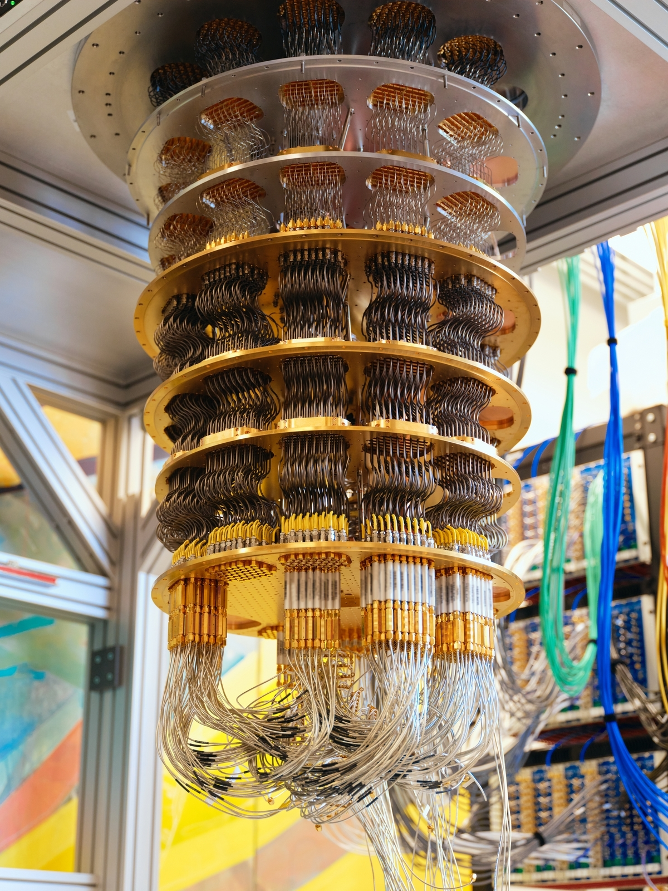

# Rayonnement du corps noir

## Chimie quantique : Introduction

Bonjour~ C’est **Nahida Maîtrise Chimie**.  
Aujourd’hui, nous commençons notre tout premier cours de *Chimie quantique* — un voyage vers le monde où même la lumière et l’énergie obéissent à des règles minuscules et mystérieuses.  

Pour commencer, il faut d’abord comprendre ce que signifie le mot *quantique*.  
Tu l’as sûrement déjà entendu, n’est-ce pas ? Il sonne un peu futuriste — comme quelque chose venu d’un laboratoire de haute technologie. Les ordinateurs quantiques, par exemple, sont aujourd’hui très célèbres !  

Mais qu’est-ce qu’un *quantum*, au juste ?  
Si tu penses au mot *quantité*, tu es déjà sur la bonne voie ! Le mot *quantum* vient de là, et signifie une petite *portion* ou *unité* de quelque chose.  
Quand tu verras comment la mécanique quantique est née, tout cela prendra un sens très clair.  

## Avant Planck (~1900)

Voyageons un peu dans le temps, à la fin du XIXᵉ siècle, pour explorer l’énigme qui a conduit à la naissance de la physique quantique — **le rayonnement du corps noir**.  
Sir **Isaac Newton** évoqua déjà ce concept dans son ouvrage *Opticks* :  

> "Do not black Bodies conceive heat more easily from Light than those of other Colours do, by reason that the Light falling on them is not reflected outwards, but enters the Bodies, and is often reflected and refracted within them, until it be stifled and lost?"  
>
> « Les corps noirs ne conçoivent-ils pas la chaleur plus facilement que les autres, parce que la lumière qui tombe sur eux n’est pas réfléchie vers l’extérieur, mais pénètre dans le corps, où elle est souvent réfléchie et réfractée, jusqu’à être étouffée et perdue ? »  

Les objets noirs absorbent toute la lumière visible sans en réfléchir.  
Mais lorsque l’énergie lumineuse pénètre à l’intérieur… où va-t-elle ?  
Après tout, l’énergie doit toujours être conservée.  

En 1858, **Balfour Stewart** découvrit qu’un corps noir absorbe et émet l’énergie de la manière la plus efficace possible.  
Un an plus tard, **Gustav Kirchhoff** montra que le spectre du rayonnement d’un corps noir dépend uniquement de la **température**, et non du **matériau**.  

Au fil du temps, les scientifiques proposèrent différentes équations pour décrire cette étrange lueur.  
Parmi elles, la formule de **Wilhelm Wien (1896)** correspondait assez bien aux expériences :  

**Loi de Wien (1896)**  
$$u(\nu,T)=a\nu^{3}e^{-b\nu/T}$$  
où  
$u$ : densité d’énergie par unité de volume à une fréquence donnée  
$\nu$ : fréquence  
$T$ : température  
$a, b$ : constantes  

Il y eut aussi plusieurs tentatives de justification théorique. En juin 1900, **Lord Rayleigh** proposa une équation fondée sur la théorie classique :  

**Loi de Rayleigh–Jeans (1900)**  
$$du(\nu,T)=\frac{8\pi\nu^{2}}{c^{3}}Ud\nu=\frac{8\pi\nu^{2}kT}{c^{3}}d\nu$$  
avec  
$c$ : vitesse de la lumière dans le vide ($c=299\,792\,458~m/s$)  
$k$ : constante de Boltzmann ($k=1.380649×10^{−23}~J/K$)  

Mais quelque chose n’allait pas du tout...  
À haute fréquence, cette équation prédisait une énergie **infinie**!  
Les physiciens appelèrent cela la **« catastrophe ultraviolette »**.  

  

La loi de Rayleigh–Jeans correspondait bien aux expériences à **basse fréquence**, tandis que celle de Wien fonctionnait à **haute fréquence** — mais aucune des deux ne racontait l’histoire complète.  

## La naissance de la physique quantique

En décembre 1900, **Max Planck** eut une idée brillante et audacieuse:  
*Et si l’énergie de la lumière n’était pas continue… mais venait par petites portions ?*  

Il appela ces petites portions **quanta**.  

**Hypothèse quantique**  
$$E=n\epsilon=nh\nu$$  
$\epsilon$ : l’unité d’énergie de la lumière  
$h=6.62607015\times10^{-34}~J\cdot s$ : constante de Planck  
$\nu$ : fréquence  

Cette idée fut la graine de la **physique quantique** — et le mot *quantum* prit alors le sens d’**une quantité d’énergie discrète**.  

---

## La loi

Pour décrire comment l’énergie se répartit entre ces quanta,  
Planck utilisa la **distribution de Boltzmann**:  

**Distribution de Boltzmann**  
$$f(E)\propto e^{\frac{E}{kT}}$$  
$f(E)$ : nombre de molécules ayant une énergie $E$  
$E$ : énergie du système  
$k$ : constante de Boltzmann  
$T$ : température  

À partir de cette relation, on peut déduire l’énergie moyenne par mode.  
Cette idée ne vient pas directement de Planck, mais fut développée plus tard par **Bose** et **Einstein** en 1924 :  

$$<E>=<f(n\epsilon)>=\frac{\sum_{n=0}^{\infty}n\epsilon e^{-n\epsilon/kT}}{\sum_{n=0}^{\infty}e^{-n\epsilon/kT}}=\frac{\epsilon}{e^{\epsilon/kT}-1}=\frac{h\nu}{e^{h\nu/kT}-1}$$  

En combinant cette expression avec les constantes physiques, on obtient :  

**Loi de Planck (variable $\nu$)**  
$$du(\nu,T)=\frac{8\pi\nu^{2}}{c^{3}}Ud\nu=\frac{8\pi h\nu^{3}}{c^{3}}\cdot\frac{1}{e^{h\nu/kT}-1}d\nu$$  
et, de manière équivalente, exprimée selon la longueur d’onde :  
**Loi de Planck (variable $\lambda$)**  
$$du(\lambda,T)=\frac{8\pi hc}{\lambda^{5}}\cdot\frac{1}{e^{hc/\lambda kT}-1}d\lambda$$  

Enfin, une seule formule réunissait **la loi de Wien** et **celle de Rayleigh–Jeans** — comme une **mélodie harmonieuse entre l’expérience et la théorie**.  

## Vérification de la loi de Planck

Toute bonne théorie doit passer l’épreuve de l’expérience.  
La loi de Planck expliquait avec élégance les observations antérieures :  

**Loi de Stefan–Boltzmann (1877)**  
*La puissance rayonnée par un corps noir (ou l’énergie totale du rayonnement) est proportionnelle à la quatrième puissance de sa température.*  
$$M=\sigma T^{4}$$  
**Loi du déplacement de Wien (1896)**  
*La longueur d’onde du maximum d’émission est inversement proportionnelle à la température.*  
$$\lambda_{pic}=\frac{b}{T}$$  

Voyons maintenant comment l’équation de Planck relie ces deux lois.  

### Loi de Stefan–Boltzmann

En intégrant la loi de Planck sur toutes les fréquences, on obtient l’énergie totale émise :  

> $$\int du=\int_{0}^{\infty}\frac{8\pi h\nu^{3}}{c^{3}}\cdot\frac{1}{e^{h\nu/kT}-1}d\nu$$  
> Posons $x=h\nu/kT$ et $dx=hd\nu/kT$ pour le calcul.  
> $$\int_{0}^{\infty}\frac{8\pi k^{3}T^{3}}{h^{2}c^{3}}\cdot\frac{x^{3}}{e^{x}-1}\cdot\frac{kT}{h}dx$$  
> On sait que la valeur de cette intégrale est :  
> $$\int_{0}^{\infty}\frac{x^{3}}{e^{x}-1}dx=\frac{\pi^{4}}{15}$$  
> Par conséquent,  
> $$E=\int du=\frac{8\pi k^{3}T^{3}}{h^{2}c^{3}}\cdot\frac{\pi^{4}}{15}\cdot\frac{kT}{h}=\frac{8\pi^{5}k^{4}T^{4}}{15h^{3}c^{3}}$$  
> Nous avons donc obtenu **l’énergie totale du rayonnement** d’un corps noir (unité = $J/m^{3}$).  
> Cependant, la loi de Stefan–Boltzmann concerne la **puissance rayonnée** (unité = $W/m^{2}$).  
> On peut convertir l’énergie volumique en flux à la surface en multipliant par $c/4$.  
> $$M=E\cdot\frac{c}{4}=\frac{8\pi^{5}k^{4}T^{4}}{15h^{3}c^{3}}\cdot\frac{c}{4}=\frac{2\pi^{5}k^{4}T^{4}}{15h^{3}c^{2}}=\sigma T^{4}$$  

**Loi de Stefan–Boltzmann**  
$$M=\sigma T^{4}=\frac{2\pi^{5}k^{4}}{15h^{3}c^{2}}T^{4}$$  
$$\sigma=\frac{2\pi^{5}k^{4}}{15h^{3}c^{2}}=5.67\times10^{-8}~W/m^{2}\cdot K^{4}$$  

Et en effet, la constante $\sigma$ correspond parfaitement aux résultats expérimentaux ~  

### Loi du déplacement de Wien

> La loi du déplacement de Wien décrit la longueur d’onde (ou la fréquence) à laquelle le rayonnement est maximal.  
> $$\frac{d(du/d\lambda)}{d\lambda}=0$$  
> La loi de Planck peut s’exprimer en fonction de la longueur d’onde :  
> $$\frac{du(\lambda,T)}{d\lambda}=\frac{8\pi hc}{\lambda^{5}}\cdot\frac{1}{e^{hc/\lambda kT}-1}$$  
> Pour simplifier, posons $\lambda=hc/xkT$ et $d\lambda=-hcdx/x^{2}kT$.  
> $$du(x,T)=-\frac{8\pi x^{5}k^{5}T^{5}}{h^{4}c^{4}}\cdot\frac{1}{e^{x}-1}dx$$  
> Nous devons trouver la valeur de $x$ qui satisfait :  
> $$\frac{d}{dx}\left(\frac{x^{5}}{e^{x}-1}\right)=\frac{5x^{4}(e^{x}-1)-x^{5}e^{x}}{(e^{x}-1)^{2}}=0$$  
> On trouve $x=\frac{hc}{\lambda kT}\approx4.9651$ (valeur numérique).  
> Ainsi, la relation devient :  
> $$\lambda_{pic}=\frac{b}{T}\approx\frac{hc}{4.9651kT}=\frac{2.90~mm/K}{T}$$  

En trouvant la longueur d’onde où le rayonnement atteint son maximum, on obtient :  

**Loi du déplacement de Wien**  
$$\lambda_{pic}=\frac{b}{T}\approx\frac{hc}{4.9651kT}=\frac{2.90~mm/K}{T}$$  

Ainsi, plus un objet est chaud, plus la longueur d’onde de sa lumière est courte — du rouge, vers le jaune, puis le blanc-bleu.  

### $\nu \rightarrow 0$

La loi de **Rayleigh–Jeans** décrit bien les résultats expérimentaux pour les basses fréquences.  
Pour les petites valeurs de $\nu$, la loi de Planck doit tendre vers celle de Rayleigh–Jeans.  

> $$\lim_{\nu\rightarrow0}du(\nu,T)=\lim_{\nu\rightarrow0}\frac{8\pi h\nu^{3}}{c^{3}}\cdot\frac{1}{e^{h\nu/kT}-1}d\nu$$  
> On sait que la limite suivante est vraie :  
> $$\lim_{x\rightarrow0}\frac{e^{x}-1}{x}=1$$  
> Ainsi,  
> $$\lim_{\nu\rightarrow0}\frac{8\pi h\nu^{3}}{c^{3}}\cdot\frac{1}{e^{h\nu/kT}-1}d\nu=\frac{8\pi kT\nu^{2}}{c^{3}}d\nu$$  

Pour les faibles fréquences, la loi de Planck se réduit donc à la loi de Rayleigh–Jeans.  

### $\nu \rightarrow \infty$

La loi de **Wien** explique bien les résultats expérimentaux pour les hautes fréquences.  
Pour les grandes valeurs de $\nu$, la loi de Planck doit tendre vers celle de Wien.  

> $$\lim_{\nu\rightarrow\infty}du(\nu,T)=\lim_{\nu\rightarrow\infty}\frac{8\pi h\nu^{3}}{c^{3}}\cdot\frac{1}{e^{h\nu/kT}-1}d\nu$$  
> Comme la fonction exponentielle croît très rapidement, on peut approcher $e^{h\nu/kT}-1$ par $e^{h\nu/kT}$.  
> $$\lim_{\nu\rightarrow\infty}\frac{8\pi h\nu^{3}}{c^{3}}\cdot\frac{1}{e^{h\nu/kT}-1}d\nu=\frac{8\pi h\nu^{3}}{c^{3}}\cdot e^{-h\nu/kT}d\nu=a\nu^{3}e^{-b\nu/T}$$  

Ainsi, pour les hautes fréquences, la loi de Planck rejoint naturellement la loi de Wien.  

---
---

## Idées et Aperçus de Planck

### Octobre 1900 : Fusion de deux lois

Planck remarqua que les lois de Wien et de Rayleigh–Jeans fonctionnaient chacune dans leur propre domaine.  
Il se demanda : et si elles étaient toutes deux des cas particuliers d’une vérité plus profonde… ?

Il étudia l’entropie et la thermodynamique, et grâce à un raisonnement élégant, il découvrit un chemin nouveau qui unissait les deux comportements en douceur.

> Pour la loi de Wien, l’énergie est une fonction exponentielle de la fréquence et de la température.  
> Pour la loi de Rayleigh-Jeans, en revanche, l’énergie est proportionnelle à la température elle-même.  
> $$U_{Wien}\propto \nu e^{-b\nu/T}~(Wien)$$  
> $$U_{RJ}\propto T~(RJ)$$  
> Pour ce travail, il appliqua d’abord la thermodynamique. Elle peut s’exprimer ainsi :  
> $$dU=TdS-PdV$$  
> L’expérience se déroulait dans une boîte avec un minuscule orifice, donc le volume du système ne change pas.  
>   
> Donc la thermodynamique peut s’écrire :  
> $$dU=TdS,~\frac{\partial S}{\partial U}=\frac{1}{T}$$  
> Planck considéra ${\partial S}/{\partial U}$ pour les deux lois :  
> $$\frac{\partial S}{\partial U}=\frac{1}{T}\propto ln(U)~(Wien)$$  
> $$\frac{\partial S}{\partial U}=\frac{1}{T}\propto\frac{1}{U}~(RJ)$$  
> Et si l’on prenait les dérivées une nouvelle fois ?  
> $$\frac{\partial^{2} S}{\partial U^{2}}\propto\frac{1}{U}~(Wien)$$  
> $$\frac{\partial^{2} S}{\partial U^{2}}\propto\frac{1}{U^{2}}~(RJ)$$  
> Ainsi, on peut obtenir $(\partial^{2} S/\partial U^{2})^{-1}$ sous forme de polynômes en U pour les deux lois :  
> $$(\frac{\partial^{2} S}{\partial U^{2}})^{-1}\propto U~(Wien)$$  
> $$(\frac{\partial^{2} S}{\partial U^{2}})^{-1}\propto U^{2}~(RJ)$$  
> Planck combina les deux polynômes ainsi :  
> $$(\frac{\partial^{2} S}{\partial U^{2}})^{-1}=C_{1}U+C_{2}U^{2}$$  
> Il conclut que l’équation de la longueur d'onde pouvait prendre la forme :  
> $$U=\frac{C\lambda^{-5}}{e^{c/\lambda T}-1}$$  

### Décembre 1900 : L’Énergie Discrète

Plus tard dans l’année, il appliqua la théorie des probabilités de Boltzmann au rayonnement — imaginant d’innombrables « éléments d’énergie » minuscules dans une cavité.  
$$\epsilon\epsilon\epsilon|\epsilon\epsilon|\epsilon|\epsilon\epsilon\epsilon|\epsilon\epsilon|\cdots$$  
où $\epsilon$ est une unité d’énergie.

Il utilisa la combinatoire pour compter toutes les dispositions possibles de ces quanta :  
$$W=\frac{(P+N-1)!}{P!(N-1)!}$$  
avec  
$P=UN/\epsilon$: nombre de particules d’énergie, $U$: énergie d’une onde lumineuse  
$N$: nombre d’ondes lumineuses

> Le $N$ est tellement grand qu’on peut considérer $N-1 \approx N$.  
> Pour un nombre suffisamment grand $n$, $n!$ s’approxime ainsi :  
> $$n!\approx\sqrt{2\pi n}(n/e)^{n}~(n\rightarrow\infty)$$  
> Comme $n^{n}$ est bien plus grand que $\sqrt{n}$, on peut écrire $W$ comme :  
> $$W=\frac{(P+N-1)!}{P!(N-1)!}\approx \frac{(P+N)^{P+N}}{P^{P}N^{N}}$$

Puis, avec une touche de magie mathématique et en s’appuyant sur le principe de Boltzmann, il relia cela à l’entropie :  
$$S=k\cdot ln(W)$$  
$S$: entropie absolue du système  
$W$: "*Wahrscheinlichkeit*", nombre de micro-états  

> Rappelons l’équation de la thermodynamique :  
> $$\frac{1}{T}=\frac{\partial S}{\partial U}=k\frac{\partial(ln(W))}{\partial U}$$  
> Comme nous avons une approximation pour $W$, on peut écrire $ln(W)$ ainsi :  
> $$ln(W)=(P+N)ln(P+N)-Pln(P)-Nln(N)=\frac{N}{\epsilon}((U+\epsilon)ln(U+\epsilon)-\epsilon ln(\epsilon)-Uln(U))$$  
> Donc, la valeur de $k\frac{\partial(ln(W))}{\partial U}$ est :  
> $$\frac{kN}{\epsilon}(ln(U+\epsilon)-ln(U))$$  
> Pour une particule d’énergie, l’entropie est :  
> $$\frac{k}{\epsilon}(ln(U+\epsilon)-ln(U))=\frac{1}{T}$$  
> Par conséquent :  
> $$U=\frac{\epsilon}{e^{\epsilon/kT}-1}=\frac{hv}{e^{hv/kT}-1}$$  

Et ainsi naquit son résultat révolutionnaire :  
$$U=\frac{\epsilon}{e^{\epsilon/kT}-1}=\frac{hv}{e^{hv/kT}-1}$$  

C’est l’équation célèbre de Planck. Chaque onde lumineuse ne peut posséder de l’énergie que par multiples entiers de $h\nu$.  
Elle révèle que l’énergie n’est pas continue, mais composée de quanta discrets.  

Il a reçu le prix Nobel de physique en 1918 pour sa découverte des quanta d'énergie.  

> *Le prix Nobel de physique 1918 a été décerné à Max Karl Ernst Ludwig Planck « en reconnaissance des services qu'il a rendus à l'avancement de la physique par sa découverte des quanta d'énergie »*

À partir de ce moment, l’humanité toucha pour la première fois le seuil du monde quantique. À cet instant, la lumière de la connaissance brilla doucement dans le ciel nocturne de la science.  
C’était l’aube de l’ère quantique et le premier aperçu des secrets les plus infimes de l’univers.  

## Références

Blackbody Radiation: Wikipedia (<https://en.wikipedia.org/wiki/Blackbody%20Radiation>)  
Planck's Law: Wikipedia (<https://en.wikipedia.org/wiki/Planck%27s%20Law>)  
Planck, M. (1900). Über eine Verbesserung der Wien’schen Strahlungsgleichung. *Verhandlungen der Deutschen Physikalischen Gesellschaft*.  
Planck, M. (1900). Zur theorie des gesetzes der energieverteilung im normalspektrum. *VhDPG*, 2, 238.  
