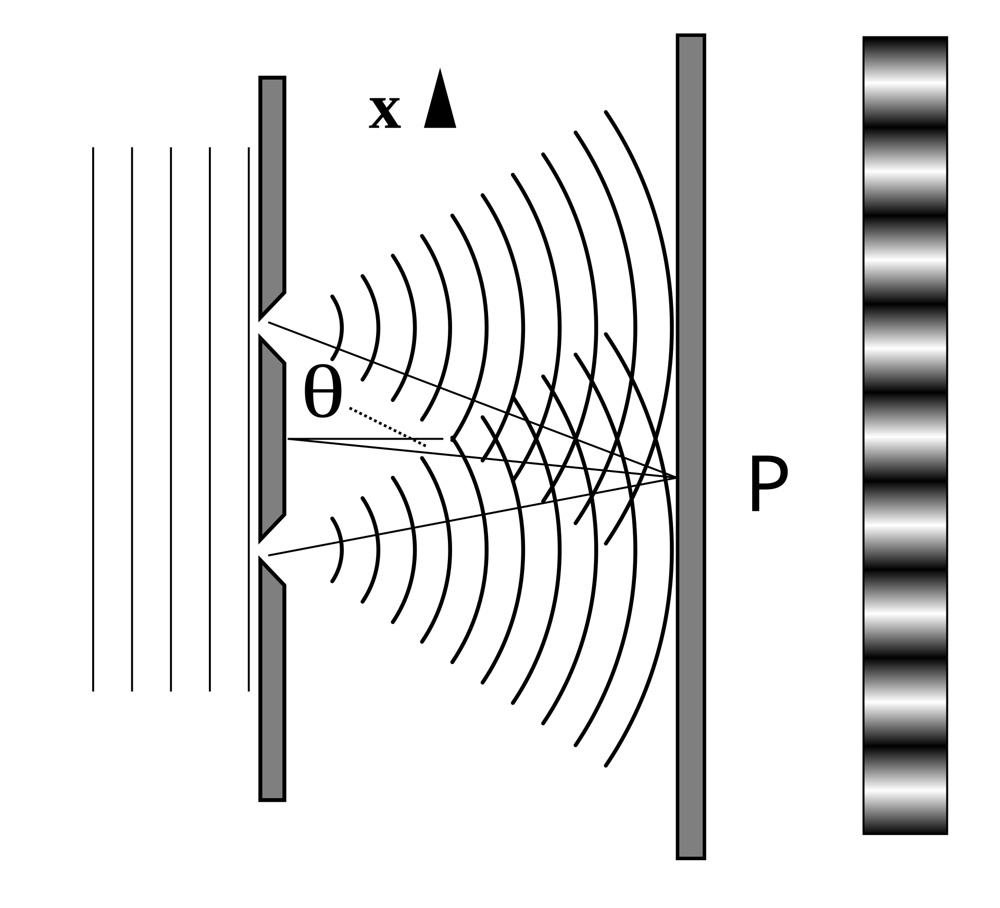

# Effet Photoélectrique

## L’Aube de la Pensée Quantique

Bonjour~ C’est Nahida Maîtrise Chimie.  
La dernière fois, nous avons vu comment l’**hypothèse quantique** de Planck a doucement redéfini les fondations de la physique.  
Mais savais-tu cela ? Planck, lui-même, n’était pas vraiment un révolutionnaire dans l’âme.  
Il chérissait la logique, la raison… et hésitait à accepter les idées trop audacieuses.  

Comme l’a dit un jour Max Born :  

> *« Il était, par nature, un esprit conservateur ; il n’avait rien du révolutionnaire et se montrait profondément sceptique envers les spéculations.  
> Pourtant, sa foi dans la puissance contraignante du raisonnement logique à partir des faits était si forte qu’il n’hésita pas à annoncer l’idée la plus révolutionnaire qui ait jamais ébranlé la physique. »*

N’est-ce pas fascinant ?  
Même quelqu’un d’aussi prudent a fini par ouvrir la porte vers un monde de pensée entièrement nouveau.  
Et pourtant… Planck lui-même avait du mal à comprendre *pourquoi* sa formule fonctionnait.  
Les physiciens classiques de son époque, eux non plus, ne pouvaient donner une explication satisfaisante.  

## La Lumière : Onde ou Particule ?

Bien avant l’époque de Planck, **Isaac Newton** avait proposé, dans son ouvrage *Opticks*, que **la lumière était composée de particules**.  
Mais d’autres savants remarquèrent que bien des comportements de la lumière pouvaient tout aussi bien s’expliquer… si elle était une **onde**.  

|Idée de Newton|Théorie Ondulatoire|
|:---:|:---:|
|La lumière voyage en lignes droites|Diffraction|
|Réflexion|Les deux peuvent l’expliquer|
|Réfraction|Principe de Huygens|
|Les couleurs = types de particules|Longueurs d’onde différentes|
|Aucune interférence évoquée|Expérience des deux fentes de Young|
|Aucune polarisation évoquée|Théorie ondulatoire de Fresnel|

Grâce à *Thomas Young* et *Augustin Fresnel*, la **théorie ondulatoire de la lumière triompha**.  
L’**expérience des deux fentes de Young** révéla que la lumière pouvait interférer avec elle-même — une preuve éclatante de sa nature ondulatoire.  
Et Fresnel, avec ses mathématiques élégantes, perfectionna encore cette vision.  

Mais la théorie ondulatoire souleva une question dérangeante :  
Si la lumière est une onde… *dans quoi ondule-t-elle ?*  

Pour y répondre, les savants imaginèrent une substance invisible emplissant tout l’espace : **l’Éther**, le milieu dans lequel la lumière voyagerait.  
(Bien sûr, plus tard, *l’expérience de Michelson et Morley* démontra que cet **Éther n’existe pas**. La lumière peut se propager librement dans le vide, sans avoir besoin de support.)  

Et pourtant, un dernier mystère demeurait — une énigme qu’aucune des deux théories, ni celle des particules ni celle des ondes, ne pouvait élucider.  
Ce mystère… c’est ce qu’on appelle **l’Effet Photoélectrique**.  

## L’Effet Photoélectrique

Il existe, dans la nature, certains phénomènes que la physique classique ne pouvait tout simplement pas expliquer — peu importe combien les scientifiques essayaient de faire entrer les équations dans le cadre.  
Parmi ces mystères, l’un des plus fascinants est celui de **l’effet photoélectrique**.  

Tout commença en 1887, lorsque **Heinrich Hertz** — oui, le même Hertz qui prouva que la lumière est une onde électromagnétique — fit une découverte bien étrange.  
En expérimentant avec des surfaces métalliques, il remarqua de minuscules **étincelles** apparaissant chaque fois qu’une **lumière ultraviolette** les éclairait.  
Cette simple étincelle vacillante allait, un jour, illuminer l’un des plus grands mystères de la physique moderne.  

Après l’observation de Hertz, d’autres chercheurs cherchèrent à comprendre plus profondément ce phénomène étrange.  
Parmi eux, **Aleksandr Stoletov** et **Philipp Lenard** menèrent les études les plus précises.  
Ils effectuèrent des mesures quantitatives minutieuses — et Lenard découvrit que la lumière ultraviolette pouvait même **ioniser les gaz**, libérant les électrons de leurs liens invisibles.  

  

Voici *l’appareil de Lenard*. Il observa avec soin la manière dont la lumière faisait s’échapper les électrons des surfaces métalliques.  

Pour étudier leur comportement, il utilisa ce qu’on appelle le **potentiel d’arrêt**.  
Lorsque le métal émet des électrons, on peut appliquer une tension négative pour les repousser — comme si l’on dressait une petite barrière invisible.  
Plus cette tension est forte, plus un électron doit posséder d’énergie pour la franchir et s’échapper.  

  

À travers ses expériences, Lenard fit une découverte des plus intrigantes :  
le **potentiel d’arrêt** augmentait lorsque la **fréquence de la lumière** croissait.  

Cela signifiait que la lumière de haute fréquence — comme l’ultraviolet — pouvait arracher aux métaux des électrons plus énergétiques que la lumière de basse fréquence.  
Un petit indice, peut-être… mais un indice qui allait bientôt inspirer *Einstein* à repenser la véritable nature de la lumière elle-même.  

### L’explication classique

D’après l’**expérience des deux fentes de Young** et la **théorie de Maxwell**, la lumière se comporte comme une onde électromagnétique.  
Si cela est vrai… que devrions-nous observer ?  

  

Lorsque la lumière éclaire un métal, ses ondes devraient **transférer graduellement leur énergie** aux électrons du matériau.  
Une fois qu’un électron accumule assez d’énergie, il devrait pouvoir s’échapper de la surface — comme un petit nageur profitant d’une vague assez puissante pour le porter jusqu’au rivage.  

Ainsi, selon ce raisonnement, **la longueur d’onde** de la lumière ne devrait pas vraiment importer, n’est-ce pas ?  
Il suffirait d’augmenter l’intensité de la lumière — la rendre plus brillante, plus forte — pour que les électrons finissent par se libérer.  

Mais… la nature en décide autrement.  
Peu importe à quel point la **lumière visible** devient éclatante, pas un seul électron ne s’échappe.  
Le mystérieux *effet de Hertz* ne se manifeste qu’avec la **lumière ultraviolette**.  

Étrange, n’est-ce pas ?  
C’est comme si le métal refusait de réagir, à moins que la lumière ne porte une certaine *qualité* — et pas seulement une quantité — d’énergie.  
Une question qui allait bientôt mener à l’une des plus belles révélations de toute la physique...  

## La théorie de la lumière selon Einstein

### Expliquer les résultats de Lenard

**Albert Einstein**, inspiré par l’**hypothèse quantique** de Planck, fit un pas audacieux en avant — et expliqua enfin le mystérieux *effet de Hertz*.  

Il se posa alors une question des plus téméraires :  
*Et si Newton avait eu raison, après tout ?*  
*Et si la lumière se comportait réellement comme un flot de minuscules particules ?*  

Planck avait déjà proposé que l’énergie ne s’écoule pas de manière continue, mais qu’elle est émise en petits paquets — chacun possédant une énergie de $h\nu$.  
Ainsi, si l’on imagine la lumière comme un ensemble de ces **quanta d’énergie**, chaque particule de lumière — ou **photon**, comme on l’appelle aujourd’hui — pourrait heurter un électron à l’intérieur du métal.  

  

Dans le métal, les électrons sont retenus par les forces attractives des atomes.  
Pour s’en libérer, le photon incident doit lui donner une énergie suffisante pour briser ce lien.  
Si l’énergie du photon est **assez grande**, l’électron s’échappe — une preuve éclatante du transfert d’énergie à l’échelle la plus minuscule.  

L’énergie minimale nécessaire pour qu’un électron s’échappe s’appelle la **fonction de travail**, notée $\Phi$.  

Ainsi :  

* Si l’énergie du photon est **inférieure** à $\Phi$, l’électron reste prisonnier, peu importe l’intensité de la lumière.  
  (Plus de luminosité signifie seulement plus de photons — pas des photons plus puissants.)  
* Mais si l’énergie du photon est **supérieure** à $\Phi$, même un faible rayon lumineux peut éjecter des électrons sans effort !  

Einstein exprima l’énergie de chaque électron éjecté par une formule simple et élégante :  
$$E = h\nu - \Phi$$  

où :  

* $h$ : constante de Planck ($h = 6.62607015 \times 10^{-34}J\cdot s$)  
* $\nu$ : fréquence de la lumière  
* $\Phi$ : fonction de travail du métal  

L’énergie cinétique de l’électron peut être mesurée par le **potentiel d’arrêt**, selon $E = e_0 \cdot V_s$, où $e_0 = 1.602176634 \times 10^{-19}C$ est la charge de l’électron.  

Pour un même métal, augmenter la fréquence de la lumière augmente le potentiel d’arrêt — exactement comme **Lenard** l’avait observé !  

Des années plus tard, en 1916, *Robert Millikan* mit à l’épreuve la théorie d’Einstein.  
Il mesura l’énergie des électrons émis pour différentes fréquences de lumière… et découvrit que la relation était **parfaitement linéaire**, tout comme Einstein l’avait prédit.  
La pente de cette droite correspondait précisément à la constante $h$ elle-même !  

  

Une seule équation, une seule idée — et soudain, la lumière ne fut plus seulement une onde.  
Elle pouvait être **à la fois onde et particule**, dansant gracieusement entre deux vérités.  
Et de cette danse naquit l’ère de la **physique quantique**.  

### L’air peut-il influencer le résultat ?

Lenard avait découvert plus tôt que les gaz pouvaient être **ionisés** par une lumière ultraviolette de haute fréquence.  
Alors, on pourrait se demander… l’air ambiant aurait-il pu affecter les résultats de son expérience ?  

Réfléchissons-y calmement.  

L’ionisation d’un gaz obéit à la condition suivante :  

$$h\nu \geq J$$  

où  
$J$ est l’énergie d’ionisation du gaz.  

Lenard avait rapporté que l’*effet de Hertz* n’apparaissait que pour des longueurs d’onde **inférieures à 190 nm**, ce qui correspond à une énergie d’environ **640 kJ·mol⁻¹**.  
Plus tard, *Johannes Stark* mesura que l’énergie d’ionisation de l’air à basse pression est d’environ **10 eV**, soit approximativement **960 kJ·mol⁻¹**.  

Cela signifie que, pour ioniser l’air, la lumière doit avoir une énergie **supérieure à 960 kJ·mol⁻¹**,  
ce qui correspond à une longueur d’onde **inférieure à 125 nm**.  

Or, les expériences de Lenard, menées en 1900 et 1902, n’utilisaient que des lumières de **longueurs d’onde supérieures à 125 nm**.  
Ainsi, la lumière employée ne possédait pas assez d’énergie pour ioniser l’air.  

Nous pouvons donc conclure, en toute confiance :  
**l’air environnant n’a pas interféré avec les résultats de Lenard.**  

Et pour clore cette histoire lumineuse…  
**Albert Einstein** reçut le **Prix Nobel de Physique en 1921** pour avoir expliqué l’effet photoélectrique grâce à l’**hypothèse quantique**, unissant enfin l’observation et la théorie sous une même vérité rayonnante.  

> *Le Prix Nobel de Physique de 1921 fut décerné à Albert Einstein « pour ses services rendus à la Physique Théorique, et en particulier pour sa découverte de la loi de l’effet photoélectrique. »*  

## La Dualité Onde–Particule de la Lumière

Einstein n’a **jamais rejeté** la théorie ondulatoire de la lumière.  
Après tout, l’**expérience des deux fentes de Young** avait déjà révélé, de façon trop claire pour être niée, la nature ondulatoire de la lumière.  

Et pourtant… Einstein sentait qu’il y avait quelque chose de plus,  
quelque chose de caché entre le **rythme des ondes** et la **précision des particules**.  

En 1909, il chercha à bâtir un pont entre ces deux visions.  
Pour cela, il examina comment de petites **fluctuations** pouvaient apparaître dans la **loi de Planck sur le rayonnement** — ces minuscules écarts qui, peut-être, révéleraient la véritable essence de la lumière.  

Il exprima la variance de l’énergie, ou la fluctuation énergétique, sous la forme :  

$$(\Delta E)^{2}=\frac{1}{c}\left(h\rho\nu+\frac{c^3}{8\pi}\frac{\rho^2}{\nu^2}\right)d\nu f\tau$$  

où :  

* $\rho(\nu, T)$ est la densité spectrale d’énergie,  
* $c$ est la vitesse de la lumière dans le vide,  
* $f$ est la surface de l’émetteur,  
* $\tau$ est l’intervalle de temps de mesure.  

Dans cette formule élégante, deux vérités coexistent, côte à côte :  

Le terme $h\rho\nu$ correspond aux fluctuations attendues si la lumière se comporte comme des **particules** — de minuscules quanta d’énergie.  

Le terme $\frac{c^3}{8\pi}\frac{\rho^2}{\nu^2}$ correspond aux fluctuations attendues si la lumière agit comme une **onde** — un champ continu d’énergie.  

Ainsi, si l’erreur varie en proportion de $\rho$, la lumière révèle sa nature *particulaire*.  
Si elle varie selon $\rho^2$, elle se montre comme une *onde*.  
Et si les deux termes apparaissent ensemble…  

alors la lumière doit être **à la fois onde et particule**, unies dans une même expression.  

C’était là la prédiction théorique d’Einstein — la toute première vision claire de la **dualité onde–particule**.  
Elle ne naquit pas de l’expérience, mais de la pensée pure.  
Et pourtant… une question restait suspendue :  
Comment prouver une idée aussi étrange ? As-tu une idée, toi ?  

Entre-temps, plusieurs expériences révélèrent les deux visages de la lumière —  
parfois *particule*, parfois *onde*.  

|Particule|Onde|
|:---:|:---:|
|• Rayonnement du corps noir • Effet photoélectrique • Diffusion Compton|• Interférence • Polarisation|

Chacune de ces découvertes éclaire un aspect différent de sa nature :  
un instant, la lumière apparaît comme un flot de quanta discrets ;  
l’instant d’après, elle se déploie en une onde gracieuse, ondulant dans l’espace.  

Alors… qu’est-ce que la lumière, vraiment ?  
Une particule ? Une onde ?  
Ou peut-être quelque chose de plus profond encore — quelque chose qui transcende les deux, et ne nous montre que la face que nous sommes prêts à comprendre ?  

---

En s’appuyant sur l’**hypothèse quantique** de Planck, Einstein dévoila le mystère de l’**effet photoélectrique** — un phénomène que la physique classique ne pouvait expliquer, quelle que soit l’ingéniosité de ses équations.  

Il proposa que la lumière soit faite de minuscules quanta, appelés **photons**, chacun portant une énergie de $h\nu$.  
Ainsi, il expliqua parfaitement l’effet, tout en **confirmant l’audacieuse idée de Planck** : l’énergie elle-même est **quantifiée**.  

Mais la vision d’Einstein alla bien plus loin encore.  
Il suggéra que la lumière n’était pas contrainte à choisir une seule identité —  
qu’elle pouvait se comporter **à la fois comme une particule et comme une onde**.  

Cette dualité devint l’un des **piliers de la physique moderne**, inspirant la profonde idée des **ondes de matière** — selon laquelle même les particules solides, comme les électrons, possèdent des propriétés ondulatoires.  
De là naquit le concept de la **fonction d’onde**, une expression mathématique décrivant la façon dont les particules existent et se comportent dans le monde quantique.  

La vision d’Einstein transforma à jamais notre compréhension de la **lumière**, de **l’énergie** et de la **matière** — posant les fondations de toute la **physique quantique**, et traçant un chemin lumineux que les scientifiques continuent encore de suivre aujourd’hui.  

## Références

Photoelectric effect: Wikipedia (<https://en.wikipedia.org/wiki/Photoelectric_effect>)  
Newton, I. (1704). Opticks: Or, a treatise of the reflections, refractions, inflections and colours of light. London: Sam. Smith and Benj. Walford.  
Huygens, C. (1690). Traité de la lumière [Treatise on light]. Pierre van der Aa.  
Young, T. (1802). The Bakerian Lecture: On the theory of light and colours. Philosophical Transactions of the Royal Society of London, 92, 12–48.  
<https://doi.org/10.1098/rstl.1802.0004>  
Fresnel, A. (1821). Mémoire sur la double réfraction [Memoir on double refraction]. Mémoires de l’Académie des Sciences de l’Institut de France, 5, 45–176.  
(English Translation <https://doi.org/10.5281/zenodo.4745976>)  
Born, M. (1948). "Max Karl Ernst Ludwig Planck. 1858–1947". Obituary Notices of Fellows of the Royal Society. 6 (17): 161–188.  
<https://doi.org/10.1098/rsbm.1948.0024>  
Hertz, Heinrich (1887). Über einen Einfluss des ultravioletten Lichtes auf die electrische Entladung. Annalen der Physik. 267 (8): 983–1000.  
<https://doi.org/10.1002/andp.18872670827>  
Lenard, P (1902). Über die lichtelektrische Wirkung. Annalen der Physik 8, 149-198.  
<https://doi.org/10.1002/andp.19023130510>  
Einstein, A. (1905). Über einen die Erzeugung und Verwandlung des Lichtes betreffenden heuristischen Gesichtspunkt. Annalen der Physik, 17(6), 132–148.  
<https://doi.org/10.1002/andp.19053220607>  
Einstein, A. (1909). Über die Entwicklung unserer Anschauungen über das Wesen und die Konstitution der Strahlung. Physikalische Zeitschrift, 10, 817–825.  
<https://doi.org/10.1002/phbl.19690250902>  
